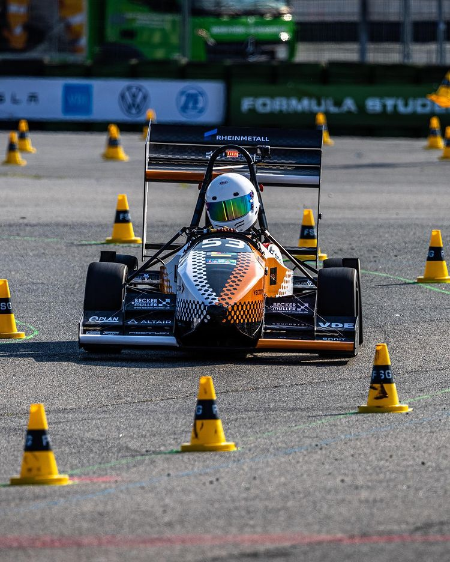
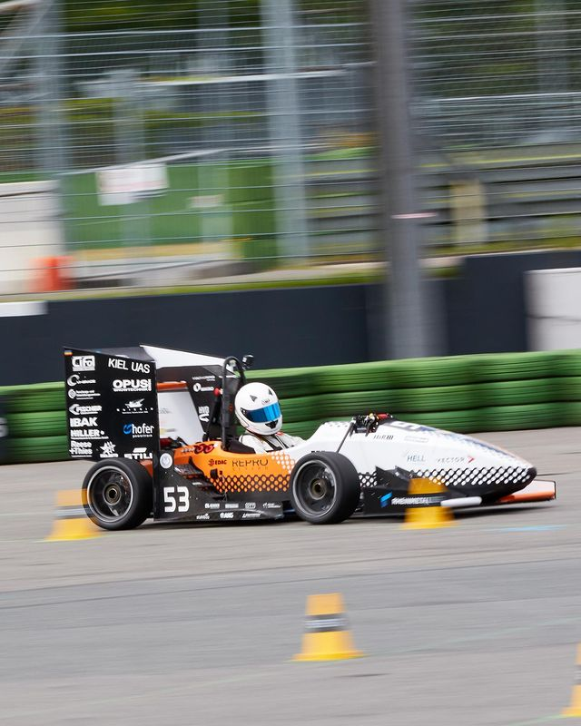

<!-- _paginate: false -->

# Master's Project: Deep Learning und Autonomous Racing
By Raphael, Rakib
Supervisors : Lars, Claudius

---
TODO :: Lots of images 
 <!-- Setting both lengths -->

---

 <!-- Setting both lengths -->

---

##  Project Overview:

- About  "Rosyard" project. 
- Race-Car discription 
- Race-track discription
- The SLAM algorithm

---

## Introduction:

-  To optimize the SLAM algorithm it needs an accurate ground truth of the track and the position of the car during a test race.
- This task of ground truth generation is divided into two subtasks. 
  -  A ground truth of the race track has to be generated.  
  -  The position of the car has to be recorded during a race. 
-  The Goal of the project is to design an algorithm that calculates the corresponding ground truth of the racecar.
  
---
- ### Possible methods	
  - **UWB based Triangulation** : Using UWB to trigulate car's position. Similar technology of AirTag but we do not have enough techincal knowledge for implementation.
  - **LiDAR** : More accurate but expensive.
  - **Image based Triangulation** : Taking the position of the cones/car and using 3D scene reconstruction using images/videos of the race-track. 

---

<video controls="controls" width="800" src="blender-car_animation/02-video0001-0080.avi"></video>
blender-car_animation/02-video0001-0080.avi

---

## Reconstruction of the race-track using Blender :

-  **Blender** :
   -  Why Blender?
   -  Scene Construction
      -  Camera Settings : Focal length 15 mm?
      -  Track length
      -  Cone size : 15 cm 
   -  Getting 2D cone and race-car's position point using scripts
  
---
### 3D Reconstruction   
- 3D Cone Reconstruction
  - How we got the 2D positions of the cones.
  - Screenshot/Demo of the Reconstruction  
-  3D Racecar reconstruction 
   -  How we got the 2D position of the  Rececar from a video.
   -  Screenshot/Demo of the Reconstruction   
-  **Affine transformation**
  

---
## Tracking the racecar with OpenCV:

- **OpenCV Tracking Algorithm** :
    - KCF : Kernelized Correlation Filte is a novel tracking framework that utilizes properties of circulant matrix to enhance the processing speed. 
       
    - CSRT : Channel and Spatial Reliability Tracking https://github.com/alanlukezic/csr-dcf
 
  
  
---

- Each tracker algorithm has their own advantages and disadvantages, but for us CSRT worked the best. 
  
 - **Color Tracking** 
   - Tracking the Racecar based on its color. i.e: Red Color.
---
## Results:
  - Video Demo of all the tracking methods.  
  - Result/Output of the tracking.   
  - Comparison graph of different trackers.

---

## Evaluation :
-  MSE Graph
-  Optimization error and plotted Graph 

---

## Project Limiations: 
   - Using only Blender generated scene.
   - Accuracy and noise of the real world are not considered.
---

## Conclusion :
   -  **Future prospects** :  
      -  Implementing the algorithm on a real-word scenario.
      -  To improve the tracking accuracy we can try better methods. i.e: Train a CNN model using images of the Racecar 