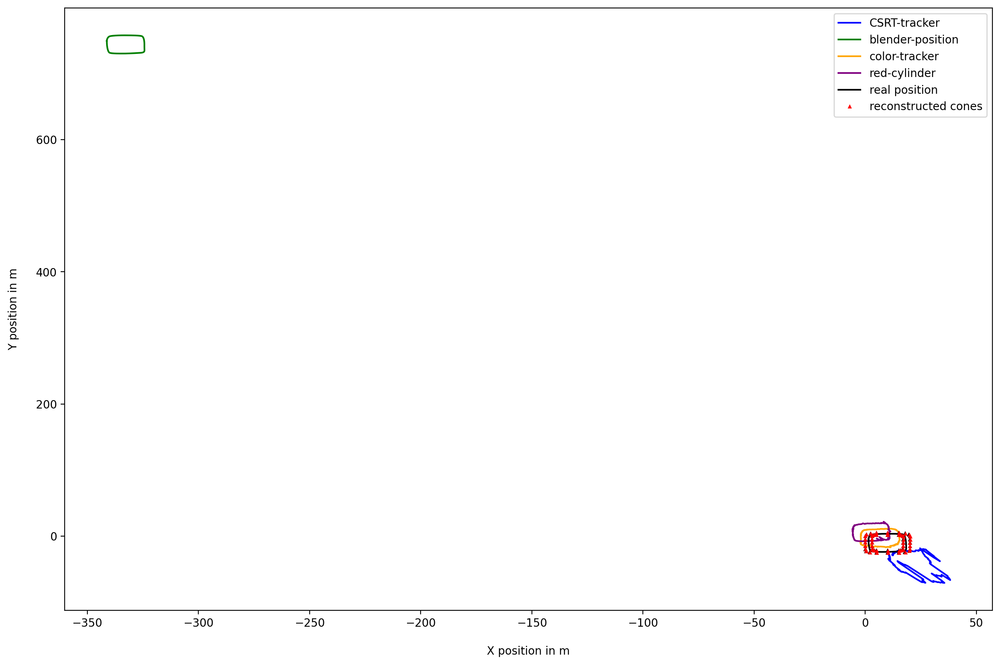
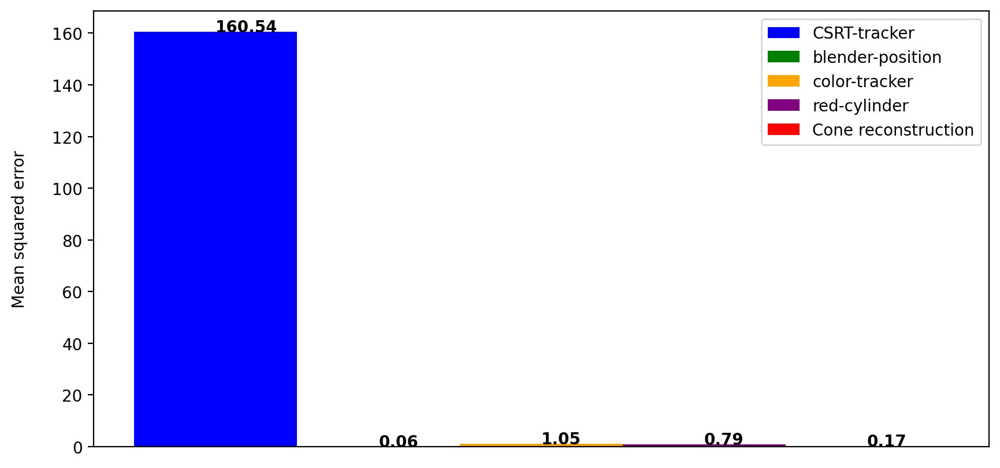
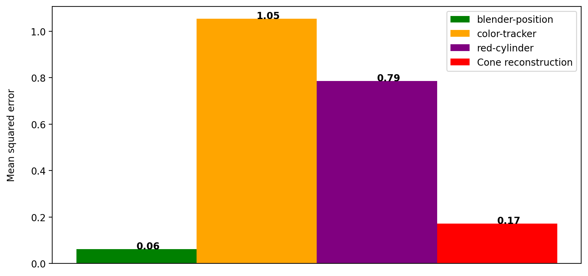
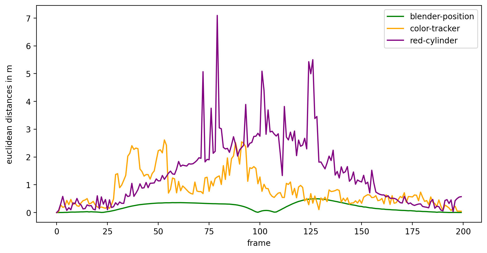
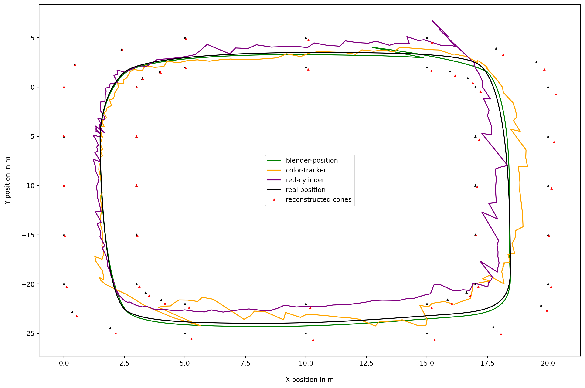
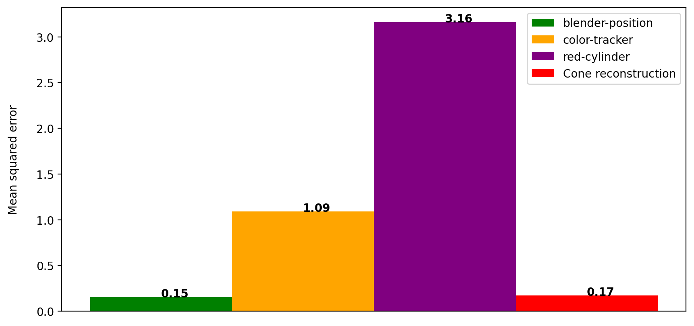
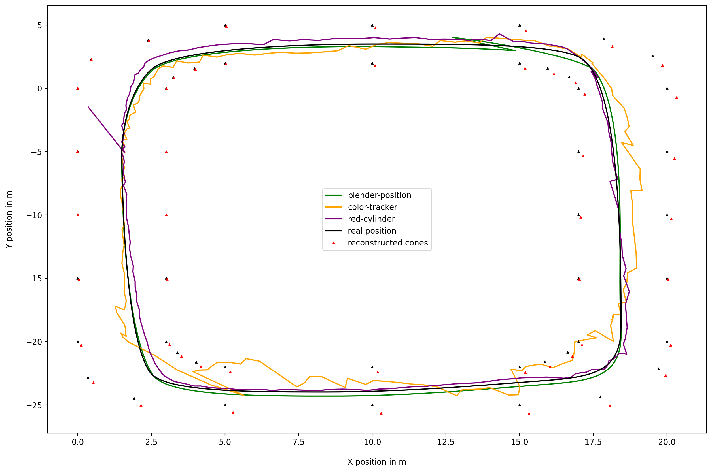

<!-- _paginate: false -->

# Master's Project: Deep Learning and Autonomous Racing

<!-- TODO: add fullnames -->

By
Raphael Schwinger, Rakibuzzaman Mahmud
Supervisors : Lars Schmarje,
Claudius Anton Zelenka

---

<!-- TODO :: Lots of images -->


---

## Project Overview:

- "Rosyard" project:
   - International design competition for Formula Student.
   - The goal of (Raceyard) project is to implement a self-driving car for Formula Student  
- (Rosyard) Race-Car discription:
  - Weight: 185 k
  - Top speed: 130 km / h
- Race-track discription:
  -  Length: 500m (Contains straights, hairpins, multiple turns)
  -  Width:  5m 
  -  Cone length: 15cm 

---

- **The SLAM algorithm**
  -  Rosyard uses a SLAM algorithm to construct a map of the racing environment while simultaneously keeping track of a car's location within it.
  -  Using SLAM facilitates detection and association of landmarks/cones. 

---

### Introduction:

- We have to optimize the SLAM algorithm. 
  - The algorithm needs an accurate ground truth of the track and the car's position during a test race.
- This task of ground truth generation is divided into two subtasks.
  - A ground truth of the cones has to be generated.
  - The position of the car while racing.
- The Goal of our project is to design an algorithm that calculates the corresponding ground truth of the racecar.

---

### Possible methods

- **LiDAR** : More accurate but expensive.
- **GPS** : High accuracy GPS is expensive and commercially available.
- **UWB based Triangulation** : Using UWB to trigulate car's position. Similar technology of AirTag but we do not have enough techincal knowledge for implementation.
- **Image based 3D Reconstruction** : Taking the position of the cones/car and using 3D scene reconstruction using images/videos of the race-track.

---

### 3D Reconstruction:

- Structure from Motion: SLAM
  - simultaneous recover 3D structure and poses of cameras
- Input:
  - image coordinates of objects for each camera
  - camera intrinsics (focal length, resolution, ...)
  - "real" position of at least 4 objects

---

#### Overview:

- first camera set to origin
- pose of second camera can be reconstructed with essential matrix $E = [t]_x R$

```python
  E = cv2.findEssentialMat(points_2D_1, points_2D_2, cameraMatrix )
  R, t = cv2.recoverPose(E, points_2D_1, points2D_2, cameraMatrix)
```
---


---

#### Overview:

- 3D points can then be triangulated

```python
   points3D = cv2.triangulatePoints(pose_1, pose_2, points1, points2)
```

- for consecutive camera images $R$ and $t$ can be recovered with Random sample consensus RANSAC algorithm
- Rodrigues algorithm can transform rotation vector $rvecs$ in Rotation matrix $R$

```python
rvecs, t = cv2.solvePnPRansac(points_3D, points_2D, cameraMatrix)
R = cv2.Rodrigues(rvecs)
```

---

#### Overview:

- further optimization can be achieved by using bundle adjustment
- we included `g2o` library for this purpose


---

## Affine transformation:

```python
-0.778266302285012 0.2502844001475607 2.6402778721299835
-0.777195115872759 0.24985856474532567 2.626459134354914
-0.7797482837759697 0.24871681814087102 2.610038240730838
-0.7793411462980047 0.2482823892723588 2.5890051058983867
```

```python
    mat = cv2.estimateAffine3D(points_3D[:4], known_points_3d)
    #  [[ 10.19  45.79  -1.93  3.93]
    #   [ 0.26  -100.2  13.86 -18.66]
    #   [ 0.00   0.00   0.00   0.15]]
```

```python
-1.978 2.243 0.15
-1.976 2.131 0.15
-1.913 1.772 0.15
-1.956 1.676 0.15
```

---

## Reconstruction of the race-track using Blender :

- **Blender** :
  - Why Blender?
  - Scene Construction
    - Camera Settings : Focal length 15 mm
    - Camera height : 1.5 m
    - 4k resolution
  
---

 Getting 2D cone and race-car's position point using scripts

```
for cone in coneCollection.objects:
        # get 3d coordinates of cone
        location = cone.location.copy()
        # location is the bottom of a cone and not the tip, the cone is 25cm high
        location[2] = cone.location[2]
        co_2d = bpy_extras.object_utils.world_to_camera_view(scene, camera, location)
```

---


---
### Simple 3D Reconstruction:


---
### Racetrack:


---
### 3D Reconstructed Racetrack: 


---


## Tracking the racecar with OpenCV:


---

<!-- TODO: we need to give / research more detail here -->
<!-- TODO: add code, screenrecording -->

- **OpenCV Tracking Algorithm** :
  - **KCF** : 
    - Kernelized Correlation Filter is a novel tracking framework 
    - One of the recent finding which has shown good results.
    - Based on the idea of traditional correlational filter.
    - It uses kernel trick and circulant matrices to significantly improve the computation speed.

---

- **CSRT** : 
    - Channel and Spatial Reliability Tracking is a constrained filter learning with arbitrary spatial reliability map.
    - CSRT utilizes spatial reliability map. 
    - Adjusts the filter support to the part of the object suitable for tracking.

- **GOTRUN**: 
  - Generic Object Tracking Using Regression Networks.
  - A Deep Learning based tracking algorithm.
  - Did not perform well.


---

```
 tracker_types = ['KCF', 'CSRT']
    tracker_type = tracker_types[1]

    if tracker_type == 'KCF':
        tracker = cv2.TrackerKCF_create()
    elif tracker_type == "CSRT":
        tracker = cv2.TrackerCSRT_create()
```

Output of the bounding Box Area:

```
p1 = (int(bbox[0]), int(bbox[1]))
p2 = (int(bbox[0] + bbox[2]), int(bbox[1] + bbox[3]))
            print(p1,p2)
```

---

##### Saving the points for each frame:

```
with open(os.path.join(current_frame_path, cam_name +  '.p2d'), 'a') as f:
                print(f'{(p1[0] + p2[0]) / 2 } {(p1[1] + p2[1]) / 2 }', file=f)
```

---

- **Color Tracking**
  - Tracking the Racecar based on a color. i.e: Red Car, Red Colored Cylinder.

```

    # definig the range of red color
    # lower boundary RED color range values; Hue (0 - 10)
    lower1 = np.array([0, 50, 30])
    upper1 = np.array([5, 255, 255])

    # upper boundary RED color range values; Hue (160 - 180)
    lower2 = np.array([180,50,30])
    upper2 = np.array([180,255,255])

```

---

### Video Demo of the tracking.

---

## Results:

<!-- TODO: add them to the slides and also add key outcomes, do that after we finished our results -->



---

#### Move track to starting point


---

#### Mean squared error



---

#### Mean squared error



---

#### Distance / Error




---

#### Prune points with high error


---

#### Pruned plot



---

#### Pruned Mean squared error



---

#### Convolution filter



---

#### Mean squared error


---

<!-- TODO: add them to the slides and also add key outcomes, do that after we finished our results -->

## Evaluation :

- "Perfect" 2D input points accuracy in $~10cm$ possible.
- 3D reconstruction highly dependent on valid 2D input points.
- Slight noise in input date results in high error.
- Point of tracking is important.

---

## Project Limiations:

- Using only Blender generated scene.
- Accuracy and noise of the real world are not considered.

---

## Conclusion :

- **Future prospects** :
  - Implementing the algorithm on a real-word scenario.
  - To improve the tracking accuracy we can try better methods. i.e: Train a CNN model using images of the Racecar.

---

# Thank You

