# Master's Project: Deep Learning and Autonomous Racing


## Sommersemester 2021


By *Raphael Schwinger, Rakibuzzaman Mahmud*

Supervisors : *Lars Schmarje,
Claudius Anton Zelenka*

<!-- Global TODOs:
  * add figure labels
  * add references
 -->

## Project Overview

<!-- TODO:
  * differ from previous group text -> do not copy text
 -->

- The master project "Ground Truth Generation"  is a part of the "Rosyard" project. 
  
Autonomous racing is an emerging field within autonomous driving. In the last years, a few self-racing vehicles have been developed, both in academic and in the industrial research. The first known autonomous vehicle competition arXiv:1804.03252v1 [cs.RO] 9 Apr 2018 was the DARPA Grand Challenge, 


Formula Student Germany organized the first autonomous racing competition in 2017 followed by other countries in 2018. Formula Student (FS) is an international engineering competition, in which multidisciplinary student teams compete with a self-developed racecar every year.


--------------------

- The main race consists of completing ten laps, as fast as possible, around an unknown track defined by small 228 × 335 mm cones. 
  
- Blue and yellow cones are used to distinguish the left and the right boundary respectively. The track is an up to 500m long closed circuit, with a minimum track width of 3m and the cones in the same boundary can be up to 5m apart. The track contains straights, hairpins, chicanes, multiple turns, and decreasing radius turns among others.


--------------


  -  Rosyard uses a SLAM algorithm to construct a map of the racing environment while simultaneously keeping track of a car's location within it.
  -  Using SLAM facilitates detection and association of landmarks/cones. 

We have to optimize the SLAM algorithm. 
  - The algorithm needs an accurate ground truth of the track and the car's position during a test race.
- This task of ground truth generation is divided into two subtasks.
  - A ground truth of the cones has to be generated.
  - The position of the car while racing.
- The Goal of our project is to design an algorithm that calculates the corresponding ground truth of the racecar.
  
The SLAM algorithm will use the results of the master project to optimize the car by getting an accurate ground truth of the track and the car's position during a test race.

The track is only marked with cones. The Simultaneous Localization and Mapping (SLAM) is designed to accept input from the camera processing pipeline. Only cones are considered as landmarks and other potential features are rejected. 

Once the map is known, the car can drive in Localization Mode which can exploit the advantage of planning on the previously mapped race-track.

Cones that mark the race-track are detected by camera to create a reconstruction of the race-track.

The maximum range of the perception sensors limits  the vehicles path planning horizon. This problem can be overcome by mapping the track and localizing the vehicle within it. 

The SLAM phase in which the module builds a 2D landmark map of the race track and the localization phase where the map is fixed and used to estimate the vehicle pose. 


- This task of ground truth generation for the SLAM algorithm is divided into two subtasks. First, a ground truth of the race track has to be generated.  Second, the position of the car has to be recorded during a race. 


- In order to define the ground truth of the race track, it is therefore sufficient to determine the positions of these cones. We will use  3D scene reconstruction using images/videos of the race track. 

---------------------------


TODO:
- [ ] introduce Raceyard project
- [ ] introduce problem, why does car needs to be tracked
- [ ] discussion on what methods could be used
- [ ] what did the premilary group


---


<!-- TODO: 
  * add this to the "Overview Section"
-->


<!-- TODO: 
  * keep this short, max 1 page
-->
### Possible methods

- **LiDAR** : More accurate but expensive.
- **GPS** : High accuracy GPS is expensive and commercially available.
- **UWB based Triangulation** : Using UWB to triangulate car's position. Similar technology of AirTag but we do not have enough technical knowledge for implementation.
- **Image based 3D Reconstruction** : Taking the position of the cones/car and using 3D scene reconstruction using images/videos of the race-track.

---
### 3D Scene Reconstruction:
<p>
    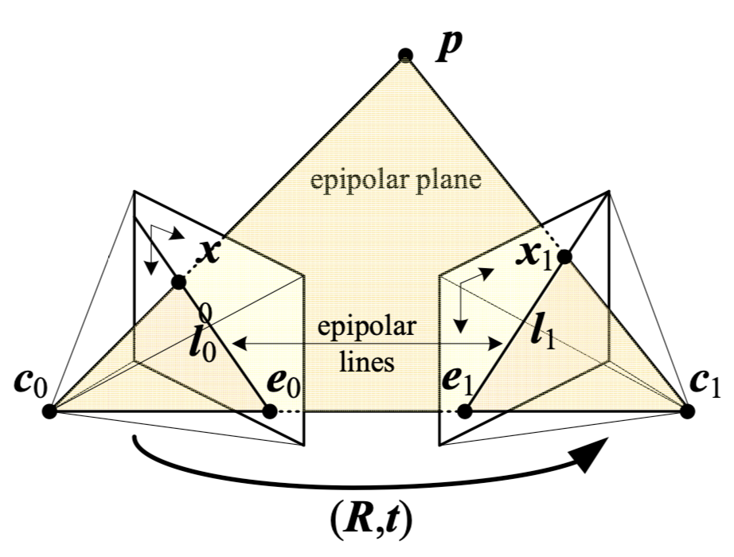
    <em>Fig: Camera matrix</em>
</p>

To reconstruct the position of both cones and the racecar we used a approach called `Structure from Motion`, thereby we were able to simultaneously recover the 3D structure of the racetrack and the poses of the used cameras. As an input only the image coordinates of the cones and the racecar and the camera intrinsics need to be provided. The later consists in particular of the set focal length and the set resolution.

First the first camera is set as the origin. The task is now to acquire the pose and position of the consecutive cameras to be able to triangulate the position of the cones and racecar. For the the second camera this can be reconstructed with the `essential matrix` $E = [t]_x R$. OpenCV provides the following functions to do this.

```python
  E = cv2.findEssentialMat(points_2D_1, points_2D_2, cameraMatrix )
  R, t = cv2.recoverPose(E, points_2D_1, points2D_2, cameraMatrix)
```

Afterwards the 3D coordinates of the cones and the racecar can be triangulated.

```python
   points3D = cv2.triangulatePoints(pose_1, pose_2, points1, points2)
```

For consecutive cameras $R$ and $t$ can be recovered with Random sample consensus `RANSAC` algorithm and the `Rodrigues algorithm`.

```python
rvecs, t = cv2.solvePnPRansac(points_3D, points_2D, cameraMatrix)
R = cv2.Rodrigues(rvecs)
```

These informations is needed to further improve the 3D points with bundle adjustment. For this purpose we included the `g2o` library.
This results in a list of 3D coordinates of the cones and the position of the racecar in the first frame of the video. To reconstruct the position of the racecar while in motion we repeated the steps for every frame of the video. Figure XX shows our initial visualisation of the result for the first frame.


<p>
    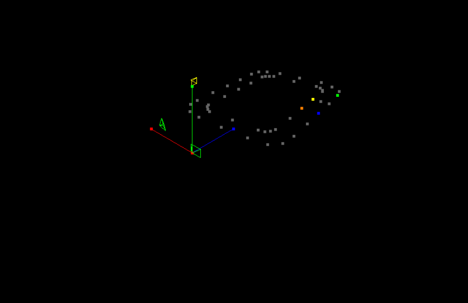
    <em>Fig: Blender Reconstruction</em>
</p>


### Affine transformation

At first glance the result looks like the real racetrack. If we take a closer look at the 3D coordinates of the reconstructed cone points we see that the points are not in the position as expected. That is because the 3D points are in relation to the first camera that is set as the origin of the coordinate system. That means the points need to be translated, rotated and in particular scaled to match the "real world". Transforming the points in all three ways is called a `Affine transformation` and can be applied by multiplying every 3D point with a `affine transformation matrix`. This matrix can be estimated with the knowledge of a correct mapping of 4 points, therefore it is necessary to measure the position from at least 4 cones. Thereby it is important that all 4 cones are not on the same plane to be able to transform 3D points that do not lie on this plane. 


```python
-0.778266302285012 0.2502844001475607 2.6402778721299835
-0.777195115872759 0.24985856474532567 2.626459134354914
-0.7797482837759697 0.24871681814087102 2.610038240730838
-0.7793411462980047 0.2482823892723588 2.5890051058983867
```

```python
    mat = cv2.estimateAffine3D(points_3D[:4], known_points_3d)
    #  [[ 10.19  45.79  -1.93  3.93]
    #   [ 0.26  -100.2  13.86 -18.66]
    #   [ 0.00   0.00   0.00   0.15]]
```

```python
-1.978 2.243 0.15
-1.976 2.131 0.15
-1.913 1.772 0.15
-1.956 1.676 0.15
```

## Reconstruction of the race-track using Blender :

TODO:
- [ ] Blender, why?


- **Blender** :
  - Why Blender?
  - Scene Construction
    - Camera Settings : Focal length 15 mm
    - Camera height : 1.5 m
    - 4k resolution


 Getting 2D cone and race-car's position point using scripts

```
for cone in coneCollection.objects:
        # get 3d coordinates of cone
        location = cone.location.copy()
        # location is the bottom of a cone and not the tip, the cone is 25cm high
        location[2] = cone.location[2]
        co_2d = bpy_extras.object_utils.world_to_camera_view(scene, camera, location)
```


## Tracking the racecar

TODO:
- [ ] Picture information from blender
- [ ] Tracking with openCV :

    - Comparison of different Object detection algorithm from openCV and how we choose CSRT algorithm as the best one.
- [ ] exact tracking? #25
- [ ] results #26

---


- **OpenCV Tracking Algorithm** :
  - **KCF** : 
    - Kernelized Correlation Filter is a novel tracking framework 
    - One of the recent findings which has shown good results.
    - Based on the idea of traditional correlational filter.
    - It uses kernel trick and circulant matrices to improve the computation speed significantly.

---

- **CSRT** : 
    - Channel and Spatial Reliability Tracking is a constrained filter learning with an arbitrary spatial reliability map.
    - CSRT utilizes a spatial reliability map. 
    - Adjusts the filter support to the part of the object suitable for tracking.

- **GOTRUN**: 
  - Generic Object Tracking Using Regression Networks.
  - A Deep Learning based tracking algorithm.
  - Did not perform well.


```
 tracker_types = ['KCF', 'CSRT']
    tracker_type = tracker_types[1]

    if tracker_type == 'KCF':
        tracker = cv2.TrackerKCF_create()
    elif tracker_type == "CSRT":
        tracker = cv2.TrackerCSRT_create()
```

Output of the bounding Box Area:

```
p1 = (int(bbox[0]), int(bbox[1]))
p2 = (int(bbox[0] + bbox[2]), int(bbox[1] + bbox[3]))
            print(p1,p2)
```


##### Saving the points for each frame:

```
with open(os.path.join(current_frame_path, cam_name +  '.p2d'), 'a') as f:
                print(f'{(p1[0] + p2[0]) / 2 } {(p1[1] + p2[1]) / 2 }', file=f)
```


- **Color Tracking**
  - Tracking the Racecar based on color. i.e: Red Car, Red Colored Cylinder.

```

    # definig the range of red color
    # lower boundary RED color range values; Hue (0 - 10)
    lower1 = np.array([0, 50, 30])
    upper1 = np.array([5, 255, 255])

    # upper boundary RED color range values; Hue (160 - 180)
    lower2 = np.array([180,50,30])
    upper2 = np.array([180,255,255])

```


## Results:


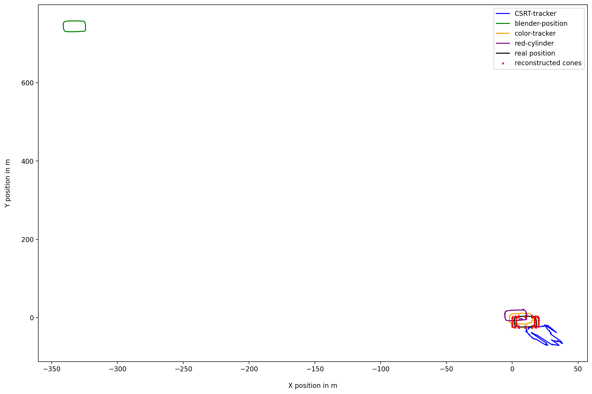


#### Move track to starting point

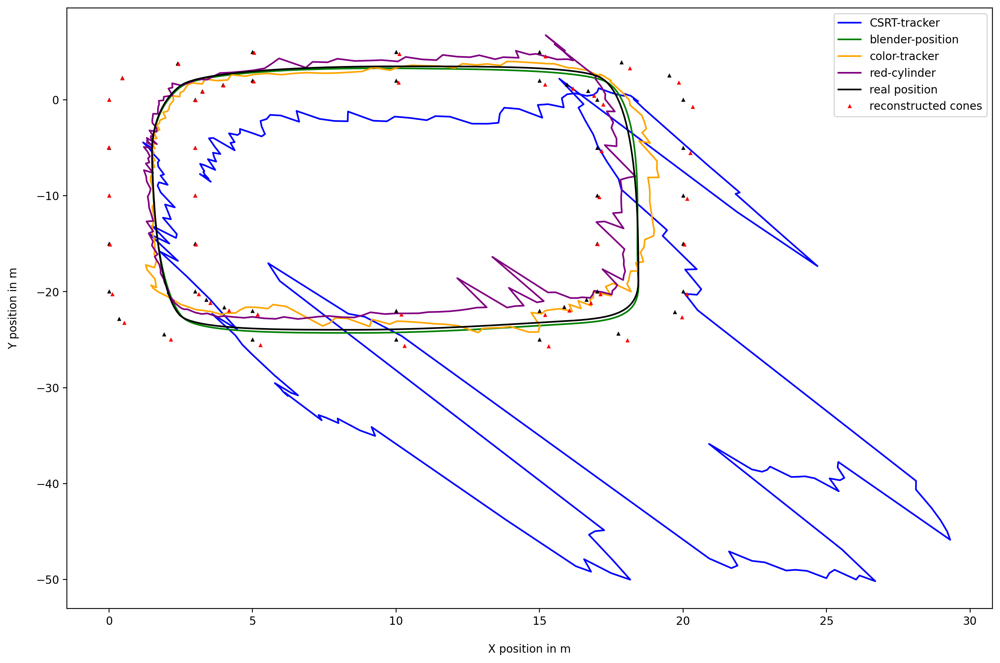


#### Mean squared error

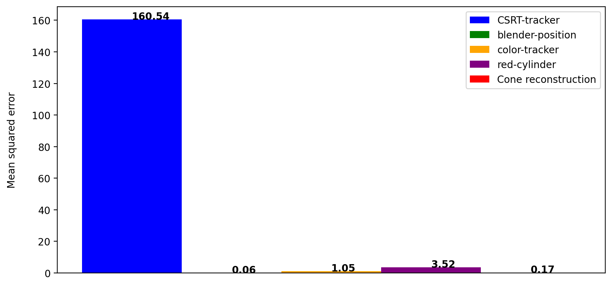


#### Mean squared error

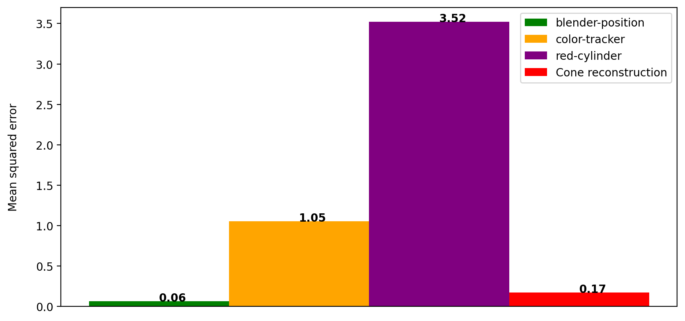


#### Distance / Error


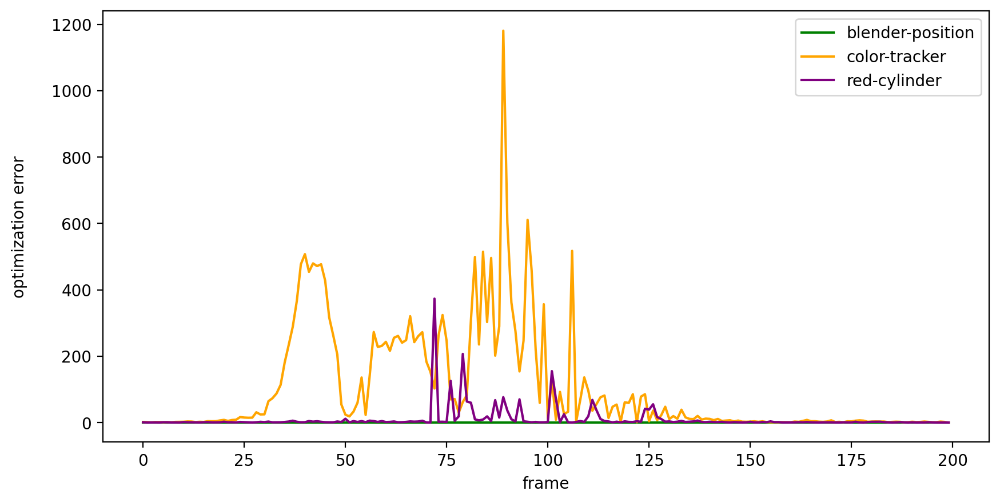


#### Prune points with high error

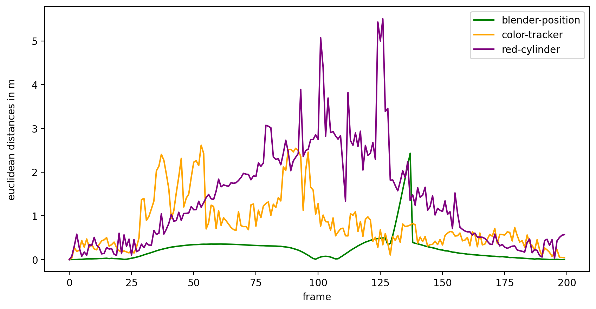
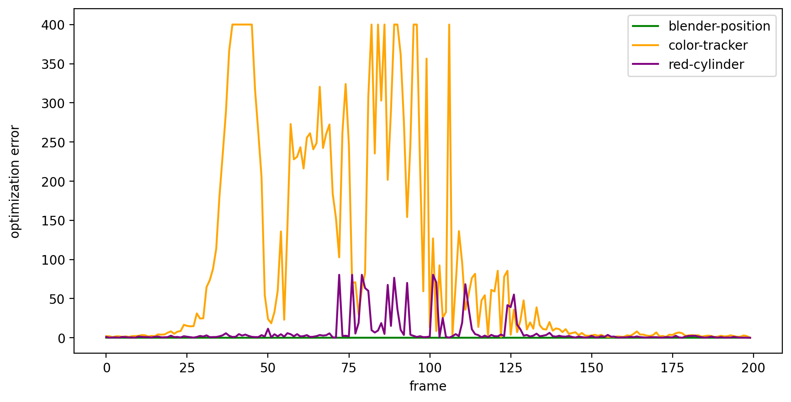


#### Pruned plot

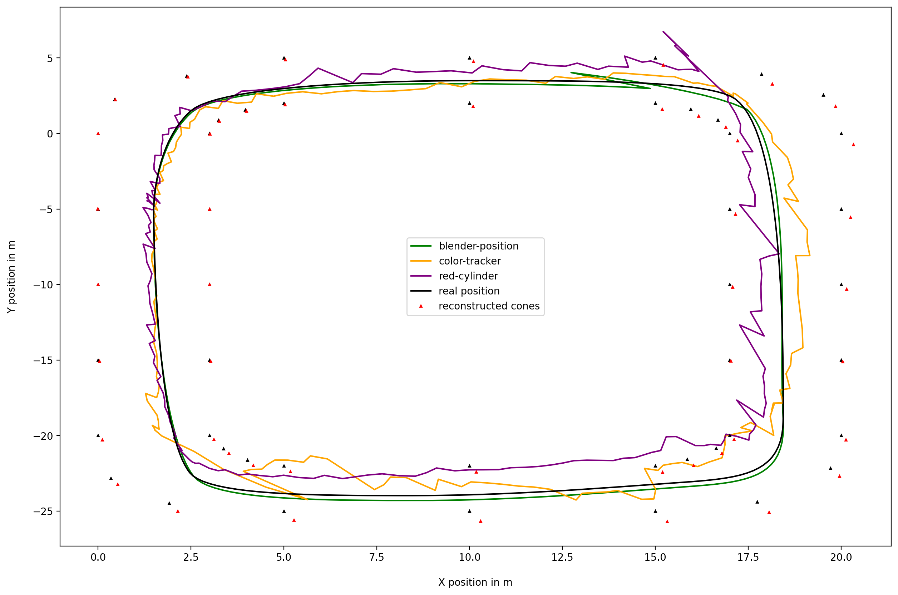


#### Pruned Mean squared error

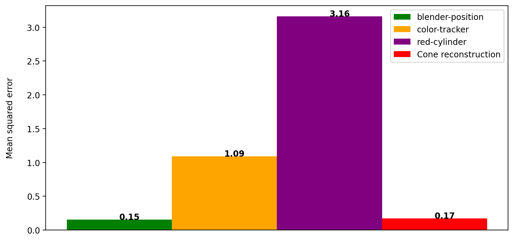


#### Convolution filter

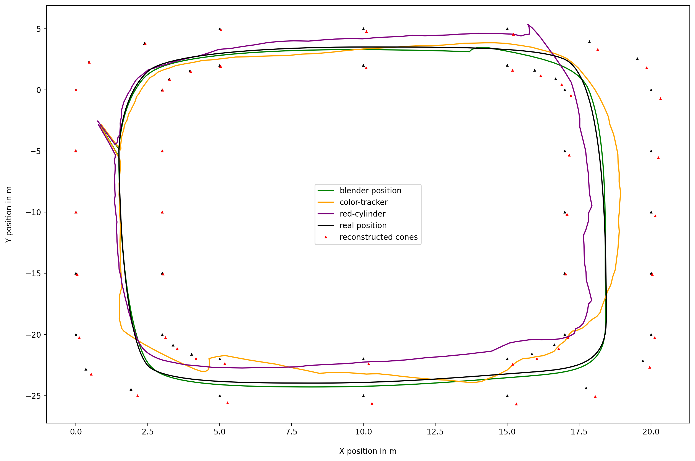


#### Mean squared error


## Evaluation :

- "Perfect" 2D input points accuracy in $~10cm$ possible.
- 3D reconstruction is highly dependent on valid 2D input points.
- Slight noise in input date results in a high error.
- Point of tracking is important.

<!--  Add this to Evaluation ## Project Limitations: -->

- Using only Blender generated scene.
- Accuracy and noise of the real world are not considered.

## Real World Guide

TODO:
- [ ] explain steps needed to try it in the real world
- [ ] written text not bullet points

1. Set at least 3 cameras which all cover the whole track
2. Get calibration matrix of camera (depends on set focal length)
2. Measure the locations of at least 4 Objects which are not on one plane
3. Film racecar with static cameras (fast shutter speed -> no motion blur)
4. Extract first frame from all cameras and annotate cone position (like previous groupe)
5. Track car in videos to extract 2D position of car
6. Perform 3D Scene Reconstruction run_reconstruction
7. Transform result with affine transformation and the "correct" location of the 4 known objects


## Conclusion :

- **Future prospects** :
  - Implementing the algorithm in a real-world scenario.
  - To improve the tracking accuracy we can try better methods. i.e: Train a CNN model using images of the Racecar.

## README

Our source code is heavily based on https://github.com/geohot/twitchslam

### Dev container setup

We bundled all dependencies in a docker container as some dependencies are not available in binary form and the correct python version is necessary to be able to run the code. Take a look at the `Dockerfile` for more information.
With VSCode we are able to develop directly inside the container without any further setup, just install VS Code and Docker, clone this repository and click on "Open Folder inside [Dev Container](https://code.visualstudio.com/docs/remote/create-dev-container)". To access the graphical user interface you can use the VNC client accessible at `http://localhost:8080/vnc.html`.

### Install Dependencies and get rendered video files

To install python dependencies run

```bash
pip install -r ./requirements
```

The rendered image files are to big to version track (and its not a best practise), you can render them localy from in the script tab of the blender file. To open the Blenderfile you can use the `openBlender.py` script inside a blender directory.

### Run Reconstruction

The main python script to start the reconstruction is `run_reconstruction.py`. As a parameter it expects a foldername.
In this folder the following things should be present:

- set correct camera focal length in lines 76, take a look at the related blender script to retrieve the correct value
- a `.png` file containing the first frame for every camera, named `01.png` respectivly
- a `.p2d` file containing the 2D points of the cones for every camera, named `01.p2d` respectivly
- a folder called `frames` containing folders for every frame, in each of those:
  - `.p2d` file representing the 2D coordinates of the car for every camera, named `01.p2d` respectivly

```bash
python run_reconstruction.py blender-racetrack
```

As a result the reconstructed 3D points of the car and the cones are saved in the files `car_reconstruction.p3d` and `cone_reconstruction.p3d`. Those coordinates are in relation to the first camera so they need to be transformed to be human readable.

### Transform points

To transform the reconstructed points back to the coordinate system set in blender use the steps:

- write the coordinates of the first 4 points in `cone_reconstruction.p3d` in a file named `known_points`, take care that the first points are not in one plane

```bash
python transform.py blender-racetrack
```

A affine transformation matrix is calculated and applied to the points in `cone_reconstruction.p3d` and saved in `cone_transformation.p3d`.

### Blender

We use [Blender](https://www.blender.org/) to generate test images for reconstruction.
For this task Blender can be scripted with the help of python. Scripts are bundled inside the `.blender` file and can be executed from within the "Scripting" tab.

To start blender with the current directory set use the [script](https://stackoverflow.com/questions/9859404/opening-blender-a-program-from-a-specific-filepath-relative-paths-unix-execu/9940691#9940691) `openBlender` inside the cone-track folder.

### Miscs

* in `utlis.py` we implemented some functions of (pypangolin)[https://github.com/uoip/pangolin] to avoid using this outdated library

# References:


