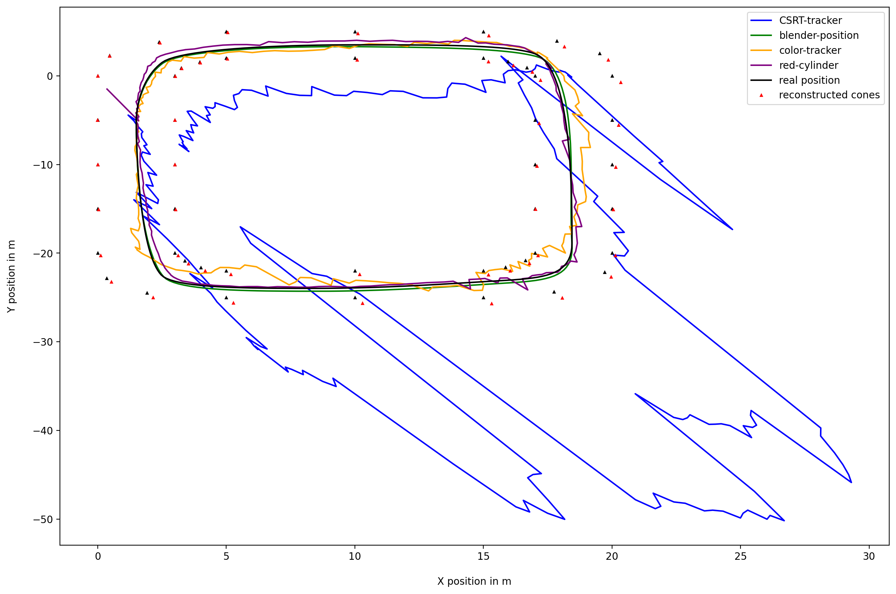

# Master's Project: Deep Learning and Autonomous Racing


## Sommersemester 2021


By *Raphael Schwinger, Rakibuzzaman Mahmud*

Supervisors : *Lars Schmarje,
Claudius Anton Zelenka*

<!-- Global TODOs:
  * add figure labels
  * add references
 -->

## Project Overview

<!-- TODO:
  * differ from previous group text -> do not copy text
 -->


- The master project "Ground Truth Generation"  is a part of the "Rosyard" project. 

- The SLAM algorithm will use the results of the master project to optimize the car by getting an accurate ground truth of the track and the car's position during a test race.

- This task of ground truth generation for the SLAM algorithm is divided into two subtasks. First, a ground truth of the race track has to be generated.  Second, the position of the car has to be recorded during a race. 


- A race track of Rosyard usually roughly covers 50 x 150 meters and is marked by two rows of cones placed parallel to each other. The cones are placed at intervals of 5 meters lengthwise to the direction of travel, the width of the track is about 3 meters, and a cone has a height of 32 cm. 

- In order to define the ground truth of the race track, it is therefore sufficient to determine the positions of these cones. We will use  3D scene reconstruction using images/videos of the race track. 


TODO:
- [ ] introduce Raceyard project
- [ ] introduce problem, why does car needs to be tracked
- [ ] discussion on what methods could be used
- [ ] what did the premilary group

---
We have to optimize the SLAM algorithm. 
  - The algorithm needs an accurate ground truth of the track and the car's position during a test race.
- This task of ground truth generation is divided into two subtasks.
  - A ground truth of the cones has to be generated.
  - The position of the car while racing.
- The Goal of our project is to design an algorithm that calculates the corresponding ground truth of the racecar.

---


- "Rosyard" project:
   - International design competition for Formula Student.
   - The goal of (Raceyard) project is to implement a self-driving car for Formula Student  
- (Rosyard) Race-Car discription:
  - Weight: 185 kg
  - Top speed: 130 km / h
- Race-track discription:
  -  Length: 500m (Contains straights, hairpins, multiple turns)
  -  Width:  5m 
  -  Cone length: 15cm 


<!-- TODO: 
  * add this to the "Overview Section"
-->
### The SLAM algorithm
  -  Rosyard uses a SLAM algorithm to construct a map of the racing environment while simultaneously keeping track of a car's location within it.
  -  Using SLAM facilitates detection and association of landmarks/cones. 


<!-- TODO: 
  * keep this short, max 1 page
-->
### Possible methods

- **LiDAR** : More accurate but expensive.
- **GPS** : High accuracy GPS is expensive and commercially available.
- **UWB based Triangulation** : Using UWB to triangulate car's position. Similar technology of AirTag but we do not have enough technical knowledge for implementation.
- **Image based 3D Reconstruction** : Taking the position of the cones/car and using 3D scene reconstruction using images/videos of the race-track.

---
### 3D Scene Reconstruction:


To reconstruct the position of both cones and the racecar we used a approach called `Structure from Motion`, thereby we were able to simultaneously recover the 3D structure of the racetrack and the poses of the used cameras. As an input only the image coordinates of the cones and the racecar and the camera intrinsics need to be provided. The later consists in particular of the set focal length and the set resolution.

First the first camera is set as the origin. The task is now to acquire the pose and position of the consecutive cameras to be able to triangulate the position of the cones and racecar. For the the second camera this can be reconstructed with the `essential matrix` $E = [t]_x R$. OpenCV provides the following functions to do this.

```python
  E = cv2.findEssentialMat(points_2D_1, points_2D_2, cameraMatrix )
  R, t = cv2.recoverPose(E, points_2D_1, points2D_2, cameraMatrix)
```

Afterwards the 3D coordinates of the cones and the racecar can be triangulated.

```python
   points3D = cv2.triangulatePoints(pose_1, pose_2, points1, points2)
```

For consecutive cameras $R$ and $t$ can be recovered with Random sample consensus `RANSAC` algorithm and the `Rodrigues algorithm`.

```python
rvecs, t = cv2.solvePnPRansac(points_3D, points_2D, cameraMatrix)
R = cv2.Rodrigues(rvecs)
```

These informations is needed to further improve the 3D points with bundle adjustment. For this purpose we included the `g2o` library.
This results in a list of 3D coordinates of the cones and the position of the racecar in the first frame of the video. To reconstruct the position of the racecar while in motion we repeated the steps for every frame of the video. Figure XX shows our initial visualisation of the result for the first frame.


### Affine transformation:

```python
-0.778266302285012 0.2502844001475607 2.6402778721299835
-0.777195115872759 0.24985856474532567 2.626459134354914
-0.7797482837759697 0.24871681814087102 2.610038240730838
-0.7793411462980047 0.2482823892723588 2.5890051058983867
```

```python
    mat = cv2.estimateAffine3D(points_3D[:4], known_points_3d)
    #  [[ 10.19  45.79  -1.93  3.93]
    #   [ 0.26  -100.2  13.86 -18.66]
    #   [ 0.00   0.00   0.00   0.15]]
```

```python
-1.978 2.243 0.15
-1.976 2.131 0.15
-1.913 1.772 0.15
-1.956 1.676 0.15
```

## Reconstruction of the race-track using Blender :

TODO:
- [ ] Blender, why?


- **Blender** :
  - Why Blender?
  - Scene Construction
    - Camera Settings : Focal length 15 mm
    - Camera height : 1.5 m
    - 4k resolution


 Getting 2D cone and race-car's position point using scripts

```
for cone in coneCollection.objects:
        # get 3d coordinates of cone
        location = cone.location.copy()
        # location is the bottom of a cone and not the tip, the cone is 25cm high
        location[2] = cone.location[2]
        co_2d = bpy_extras.object_utils.world_to_camera_view(scene, camera, location)
```


## Tracking the racecar

TODO:
- [ ] Picture information from blender
- [ ] Tracking with openCV :

    - Comparison of different Object detection algorithm from openCV and how we choose CSRT algorithm as the best one.
- [ ] exact tracking? #25
- [ ] results #26

---


- **OpenCV Tracking Algorithm** :
  - **KCF** : 
    - Kernelized Correlation Filter is a novel tracking framework 
    - One of the recent findings which has shown good results.
    - Based on the idea of traditional correlational filter.
    - It uses kernel trick and circulant matrices to improve the computation speed significantly.

---

- **CSRT** : 
    - Channel and Spatial Reliability Tracking is a constrained filter learning with an arbitrary spatial reliability map.
    - CSRT utilizes a spatial reliability map. 
    - Adjusts the filter support to the part of the object suitable for tracking.

- **GOTRUN**: 
  - Generic Object Tracking Using Regression Networks.
  - A Deep Learning based tracking algorithm.
  - Did not perform well.


```
 tracker_types = ['KCF', 'CSRT']
    tracker_type = tracker_types[1]

    if tracker_type == 'KCF':
        tracker = cv2.TrackerKCF_create()
    elif tracker_type == "CSRT":
        tracker = cv2.TrackerCSRT_create()
```

Output of the bounding Box Area:

```
p1 = (int(bbox[0]), int(bbox[1]))
p2 = (int(bbox[0] + bbox[2]), int(bbox[1] + bbox[3]))
            print(p1,p2)
```


##### Saving the points for each frame:

```
with open(os.path.join(current_frame_path, cam_name +  '.p2d'), 'a') as f:
                print(f'{(p1[0] + p2[0]) / 2 } {(p1[1] + p2[1]) / 2 }', file=f)
```


- **Color Tracking**
  - Tracking the Racecar based on color. i.e: Red Car, Red Colored Cylinder.

```

    # definig the range of red color
    # lower boundary RED color range values; Hue (0 - 10)
    lower1 = np.array([0, 50, 30])
    upper1 = np.array([5, 255, 255])

    # upper boundary RED color range values; Hue (160 - 180)
    lower2 = np.array([180,50,30])
    upper2 = np.array([180,255,255])

```


## Results:


#### Move track to starting point




#### Mean squared error


#### Mean squared error


#### Distance / Error


#### Prune points with high error


#### Pruned plot


#### Pruned Mean squared error


#### Convolution filter


#### Mean squared error


## Evaluation :

- "Perfect" 2D input points accuracy in $~10cm$ possible.
- 3D reconstruction is highly dependent on valid 2D input points.
- Slight noise in input date results in a high error.
- Point of tracking is important.

<!--  Add this to Evaluation ## Project Limitations: -->

- Using only Blender generated scene.
- Accuracy and noise of the real world are not considered.

## Real World Guide

TODO:
- [ ] explain steps needed to try it in the real world
- [ ] written text not bullet points

1. Set at least 3 cameras which all cover the whole track
2. Get calibration matrix of camera (depends on set focal length)
2. Measure the locations of at least 4 Objects which are not on one plane
3. Film racecar with static cameras (fast shutter speed -> no motion blur)
4. Extract first frame from all cameras and annotate cone position (like previous groupe)
5. Track car in videos to extract 2D position of car
6. Perform 3D Scene Reconstruction run_reconstruction
7. Transform result with affine transformation and the "correct" location of the 4 known objects


## Conclusion :

- **Future prospects** :
  - Implementing the algorithm in a real-world scenario.
  - To improve the tracking accuracy we can try better methods. i.e: Train a CNN model using images of the Racecar.

## README

TODO:
* [ ] how to run
* [ ] roughly explain the different python scripts and name the imputs that need to be given

## Miscs

TODO:
- [ ] add this to the README


* [ ] Dev Container: Our implementation depends on various software packages in different versions, that's why we worke on a Docker dev container. Descirption of how we used dev container to manage our virtualbox.

* [ ] Pypangolin version error fix descriptio


# References:


